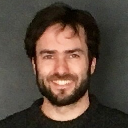

My current objective is to leverage computer and data sciences to better understand biological systems and predict their behavior. 

My research interests are in the area of **knowledge engineering** (semantic web, linked data) and **distributed systems** (workflows, large scale computing infrastructures) for better 
 - searching and reusing massive, distributed and heterogeneous datasets, as well as 
 - producing few yet meaningfull information. 

Since september 2014, I coordinate the [SyMeTRIC](http://symetric.univ-nantes.fr) project. SyMeTRIC is a french regional project in **Systems Medicine**, funded by the Pays de la Loire region. SyMeTRIC aims at building a common Systems Medicine computing infrastructure to accelerate the discovery and validation of biomarkers in the fields of oncology, transplantation, and chronic cardiovascular diseases.

[More details here ...](about)
