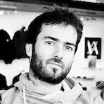

Closely linked to **life science applications** (medical imaging, \*-omics data analysis), my research interests cover the fields of **knowledge engineering** (semantic web, linked data) and **distributed systems** (workflows, large scale computing infrastructures) to better i) query massive, distributed and heterogeneous datasets, as well as ii) produce few yet meaningfull data. I'm currently involved in the [CrEDIBLE](http://credible.i3s.unice.fr) research project. 

Since september 2014, I coordinate the [SyMeTRIC](http://symetric.univ-nantes.fr) project. SyMeTRIC is a french regional project in **Systems Medicine**, funded by the Pays de la Loire region. SyMeTRIC aims at building a common Systems Medicine computing infrastructure to accelerate the discovery and validation of biomarkers in the fields of oncology, transplantation, and chronic cardiovascular diseases.

[More details here ...](about)